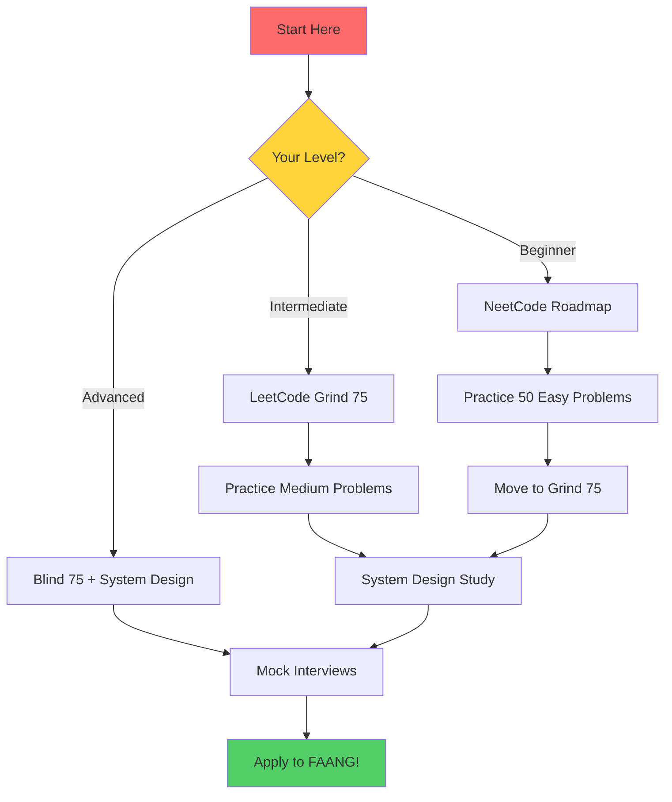

<div align="center">

# 🚀 Awesome FAANG Interview Resources

### *Your Ultimate Guide to Landing Your Dream Tech Job in 2025* 🎯

[](https://github.com/umitkacar/awesome-faang-interview/stargazers)
[](https://github.com/umitkacar/awesome-faang-interview)
[](https://github.com/umitkacar/awesome-faang-interview/pulls)
[](LICENSE)


</div>

---

## 📊 Repository Stats

<div align="center">

| 📚 Resources | 🎥 YouTube Channels | 📖 Books | 🌐 Platforms | 🤖 AI/ML Section |
|:---:|:---:|:---:|:---:|:---:|
| **150+** | **15+** | **20+** | **25+** | **✅ NEW** |

</div>

---

## 📑 Table of Contents

- [🎯 FAANG Interview Essentials](#-faang-interview-essentials)
- [📺 Top YouTube Channels 2025](#-top-youtube-channels-2025)
- [💾 Data Structures & Algorithms](#-data-structures--algorithms)
- [🎓 Object Oriented Programming](#-object-oriented-programming)
- [📚 Must-Read Books 2024-2025](#-must-read-books-2024-2025)
- [💻 Online Coding Platforms](#-online-coding-platforms)
- [🤖 AI & Machine Learning Interviews](#-ai--machine-learning-interviews)
- [🏗️ System Design Resources](#%EF%B8%8F-system-design-resources)
- [🎁 Additional Resources](#-additional-resources)

---

<div align="center">

## 🎯 FAANG Interview Essentials

*Start your journey with these battle-tested resources* ⚡

</div>

### 🔥 Essential Interview Prep Paths

| Resource | Description | Difficulty | 🌟 Rating |
|----------|-------------|------------|-----------|
| [**NeetCode 150**](https://neetcode.io/) | 🏆 Most popular for 2024-2025! Curated list with video explanations | ⭐⭐⭐ | ⭐⭐⭐⭐⭐ |
| [**LeetCode Grind 75**](https://www.techinterviewhandbook.org/grind75) | Structured study plan, time-optimized | ⭐⭐⭐ | ⭐⭐⭐⭐⭐ |
| [**Blind 75**](https://www.teamblind.com/post/New-Year-Gift---Curated-List-of-Top-75-LeetCode-Questions-to-Save-Your-Time-OaM1orEU) | Classic must-do problems | ⭐⭐⭐ | ⭐⭐⭐⭐⭐ |
| [**Tech Interview Handbook**](https://www.techinterviewhandbook.org/) | Complete interview guide | ⭐⭐ | ⭐⭐⭐⭐⭐ |
| [**System Design Primer**](https://github.com/donnemartin/system-design-primer) | 200K+ stars on GitHub! | ⭐⭐⭐⭐ | ⭐⭐⭐⭐⭐ |

### 🎬 Top Video Courses (2024-2025)

```
🎓 NeetCode 150 Course on freeCodeCamp [38+ hours]
   └─ All 150 problems explained with optimal solutions

📚 Data Structures and Algorithms in Python [12+ hours]
   └─ Complete beginner to advanced coverage

🚀 Google Engineer's Full Tutorial [10+ hours]
   └─ Real-world problems from a Googler
```

- 🎥 [**NeetCode 150 Course on freeCodeCamp**](https://www.youtube.com/watch?v=KLlXCFG5TnA) - 38+ hours masterclass
- 📘 [**Data Structures and Algorithms in Python**](https://www.youtube.com/watch?v=pkYVOmU3MgA) - Full course for beginners
- 🎯 [**Google Engineer's Tutorial**](https://www.youtube.com/watch?v=RBSGKlAvoiM) - Easy to advanced course

---

<div align="center">

## 📺 Top YouTube Channels 2025

*Learn from the best! These channels have helped thousands land FAANG offers* 🎓

</div>

### 💻 Coding Interview Channels

<table>
<tr>
<td align="center" width="25%">
<br>
<a href="https://www.youtube.com/@NeetCode"><b>NeetCode</b></a><br>
👤 360K+ subs<br>
🏢 Google Engineer<br>
⭐ Best LeetCode explanations
</td>
<td align="center" width="25%">
<br>
<a href="https://www.youtube.com/@clem"><b>Clement Mihailescu</b></a><br>
👤 500K+ subs<br>
🏢 Ex-Google/Facebook<br>
⭐ AlgoExpert Founder
</td>
<td align="center" width="25%">
<br>
<a href="https://www.youtube.com/@BackToBackSWE"><b>Back To Back SWE</b></a><br>
👤 250K+ subs<br>
💡 Clear explanations<br>
⭐ Complex topics simplified
</td>
<td align="center" width="25%">
<br>
<a href="https://www.youtube.com/@takeUforward"><b>TakeUForward</b></a><br>
👤 600K+ subs<br>
📚 Striver's A2Z DSA<br>
⭐ Complete roadmap
</td>
</tr>
</table>

#### 🎯 More Awesome Channels

- 📺 [**Nick White**](https://www.youtube.com/@NickWhite) - Live coding sessions and tutorials
- 🎓 [**William Fiset**](https://www.youtube.com/@WilliamFiset-videos) - In-depth algorithms and data structures
- 💙 [**freeCodeCamp.org**](https://www.youtube.com/@freecodecamp) - Full courses and tutorials (1M+ hours of content!)

### 🏗️ System Design & Career Channels

| Channel | Focus Area | Subscribers | Must Watch |
|---------|-----------|-------------|------------|
| [**ByteByteGo**](https://www.youtube.com/@ByteByteGo) | System Design | 500K+ | Alex Xu's channel 🔥 |
| [**tryExponent**](https://www.youtube.com/@tryexponent) | Mock Interviews | 300K+ | Real interview practice |
| [**System Design Interview**](https://www.youtube.com/@SystemDesignInterview) | Architecture | 200K+ | Design patterns |
| [**TechLead**](https://www.youtube.com/@TechLead) | Career Advice | 1M+ | Ex-Google/Facebook |

---

<div align="center">

## 💾 Data Structures & Algorithms

*Master the fundamentals that 90% of interviews test* 📊

</div>

### 🎯 Essential Resources

<table>
<tr>
<td width="33%" align="center">
<br>
<a href="https://www.bigocheatsheet.com/"><b>Big O Cheat Sheet</b></a><br>
⏱️ Time & Space complexity reference
</td>
<td width="33%" align="center">
<br>
<a href="https://visualgo.net/"><b>VisuAlgo</b></a><br>
👀 See algorithms in action!
</td>
<td width="33%" align="center">
<br>
<a href="https://neetcode.io/roadmap"><b>NeetCode Roadmap</b></a><br>
🗺️ Structured learning path
</td>
</tr>
</table>

### 📚 Top DSA Courses

```diff
+ AlgoExpert         → 160+ curated problems with video explanations ($99)
+ AlgoMonster        → Pattern-based learning, very structured
+ Udemy Bootcamp     → Complete Python DSA course
+ CodeBasics         → Free Python DSA course
```

- 🎯 [**AlgoExpert**](https://www.algoexpert.io/) - 160+ curated problems with video explanations ($99)
- 🧠 [**AlgoMonster**](https://algo.monster/) - Pattern-based learning approach
- 📖 [**Udemy - DSA Bootcamp in Python**](https://www.udemy.com/course/data-structures-and-algorithms-bootcamp-in-python/)
- 🆓 [**CodeBasics - DSA in Python**](https://codebasics.io/courses/data-structures-and-algorithms-in-python)

---

<div align="center">

## 🎓 Object Oriented Programming

*Essential for system design and coding interviews* 🏛️

</div>

| Resource | Type | Level | Link |
|----------|------|-------|------|
| 🐍 Real Python OOP | Tutorial Path | ⭐⭐ | [Visit](https://realpython.com/learning-paths/object-oriented-programming-oop-python/) |
| 📺 Corey Schafer | Video Series | ⭐⭐ | [Watch](https://www.youtube.com/playlist?list=PL-osiE80TeTsqhIuOqKhwlXsIBIdSeYtc) |
| 🎨 Design Patterns | Interactive Guide | ⭐⭐⭐ | [Learn](https://refactoring.guru/design-patterns) |

---

<div align="center">

## 📚 Must-Read Books 2024-2025

*Invest in these proven resources* 💎

</div>

### 🆕 New Releases (2024-2025)

<table>
<tr>
<td width="33%" align="center">
<br>
<b>Beyond Cracking the Coding Interview</b><br>
📝 Gayle McDowell<br>
⭐⭐⭐⭐⭐<br>
<a href="https://www.beyondctci.com/">Get Book</a>
</td>
<td width="33%" align="center">
<br>
<b>Coding Interview Patterns</b><br>
📝 Alex Xu & Shaun<br>
⭐⭐⭐⭐⭐<br>
<a href="https://bytebytego.com/">Get Book</a>
</td>
<td width="33%" align="center">
<br>
<b>Generative AI System Design</b><br>
📝 Alex Xu<br>
⭐⭐⭐⭐⭐<br>
<a href="https://blog.bytebytego.com/p/our-new-book-generative-ai-system">Get Book</a>
</td>
</tr>
</table>

### 📖 Coding Interview Classics

```
📕 Cracking the Coding Interview (6th Edition) ⭐⭐⭐⭐⭐
   ├─ 189 programming problems
   ├─ Still #1 for FAANG interviews
   └─ Solutions in multiple languages

📘 Elements of Programming Interviews in Python ⭐⭐⭐⭐⭐
   ├─ 250+ challenging problems
   ├─ Perfect for senior positions
   └─ Deep algorithmic thinking

📙 Grokking Algorithms ⭐⭐⭐⭐
   ├─ Illustrated guide
   ├─ Great for beginners
   └─ Easy to understand
```

| Title | Author | Focus | Amazon |
|-------|--------|-------|--------|
| **Cracking the Coding Interview** | Gayle Laakmann McDowell | 189 problems | [🛒 Buy](https://www.amazon.com/dp/0984782850) |
| **Elements of Programming Interviews** | Aziz, Lee, Prakash | 250+ problems | [🛒 Buy](https://www.amazon.com/dp/1537713949) |
| **Grokking Algorithms** | Aditya Bhargava | Illustrated guide | [🛒 Buy](https://www.amazon.com/dp/1617292230) |

### 🏗️ System Design Books

> **🔥 Most Recommended for 2025**

| Book | Author | Level | Rating |
|------|--------|-------|--------|
| 📕 **System Design Interview Vol. 1** | Alex Xu | ⭐⭐⭐ | ⭐⭐⭐⭐⭐ [Get it](https://www.amazon.com/dp/B08CMF2CQF) |
| 📕 **System Design Interview Vol. 2** | Alex Xu | ⭐⭐⭐⭐ | ⭐⭐⭐⭐⭐ [Get it](https://www.amazon.com/dp/1736049119) |
| 📘 **Acing the System Design Interview** | Zhiyong Tan | ⭐⭐⭐ | ⭐⭐⭐⭐ [Get it](https://www.amazon.com/dp/1633439100) |
| 📙 **Designing Data-Intensive Applications** | Martin Kleppmann | ⭐⭐⭐⭐⭐ | ⭐⭐⭐⭐⭐ [Get it](https://www.amazon.com/dp/1449373321) |

### 💼 Behavioral & Career

- 📗 [**The Tech Resume Inside Out**](https://www.amazon.com/dp/B08J2DW6BQ) - Gergely Orosz ⭐⭐⭐⭐⭐
- 🎯 [**Behavioral Interview Questions**](https://www.techinterviewhandbook.org/behavioral-interview-questions) - Free online guide

### 🤖 AI/ML Interview Books

| Book | Focus | Link |
|------|-------|------|
| 📕 **Hands-on Machine Learning** (3rd Ed) | Practical ML with Scikit-Learn & TensorFlow | [Amazon](https://www.amazon.com/dp/1492032646) |
| 📘 **Machine Learning Interviews** | Free comprehensive guide | [GitHub](https://github.com/alirezadir/Machine-Learning-Interviews) |
| 📙 **Deep Learning Interviews** | 400+ questions and answers | [Amazon](https://www.amazon.com/dp/B08W3HPNDK) |

---

<div align="center">

## 💻 Online Coding Platforms

*Practice makes perfect* 🎯

</div>

### 🏆 Problem Solving Platforms

<table>
<tr>
<td align="center" width="20%">
<br>
<a href="https://leetcode.com/"><b>LeetCode</b></a><br>
⭐ #1 Platform<br>
📊 3000+ problems
</td>
<td align="center" width="20%">
<br>
<a href="https://neetcode.io/"><b>NeetCode</b></a><br>
🎥 Video solutions<br>
🔥 Most popular 2025
</td>
<td align="center" width="20%">
<br>
<a href="https://www.hackerrank.com/"><b>HackerRank</b></a><br>
🏅 Certifications<br>
💼 Job matching
</td>
<td align="center" width="20%">
<br>
<a href="https://codeforces.com/"><b>CodeForces</b></a><br>
🏆 Competitive<br>
⚡ Contest rated
</td>
<td align="center" width="20%">
<br>
<a href="https://www.codechef.com/"><b>CodeChef</b></a><br>
🌍 Global contests<br>
📈 Rating system
</td>
</tr>
</table>

### 🎓 Interview Prep Platforms

```
💎 Premium Platforms (Worth the Investment)
```

| Platform | Price/Year | Focus | Best For | Rating |
|----------|-----------|-------|----------|--------|
| [**DesignGurus.io**](https://www.designgurus.io/) | $122 | Pattern-based learning | Visual learners | ⭐⭐⭐⭐⭐ |
| [**AlgoExpert**](https://www.algoexpert.io/) | $99 | 160+ curated problems | Structured prep | ⭐⭐⭐⭐⭐ |
| [**AlgoMonster**](https://algo.monster/) | $99 | Pattern recognition | Fast track | ⭐⭐⭐⭐⭐ |
| [**Educative.io**](https://www.educative.io/) | $199 | Interactive courses | Hands-on learning | ⭐⭐⭐⭐ |
| [**InterviewBit**](https://www.interviewbit.com/) | FREE | Complete prep | Budget option | ⭐⭐⭐⭐ |

### 🎯 Mock Interview Platforms

> **Practice with real people!**

| Platform | Type | Price | Features |
|----------|------|-------|----------|
| 🎭 [**Pramp (Exponent)**](https://www.tryexponent.com/practice) | Peer-to-peer | FREE (5/month) | AI grading, transcripts |
| 💼 [**Interviewing.io**](https://interviewing.io/) | Anonymous | Paid | Real engineers from FAANG |
| 🎪 [**TechMockInterview**](https://techmockinterview.com/) | 1-on-1 | Paid | Personalized feedback |

### 📊 Assessment Platforms

- 📝 [**TestDome**](https://www.testdome.com/) - Skills assessment & certifications
- 💻 [**DevSkiller**](https://devskiller.com/) - Technical screening for companies
- 🤖 [**Workera.ai**](https://workera.ai/) - AI skills assessment
- 📊 [**DataCamp**](https://www.datacamp.com/) - Data science focused

---

<div align="center">

## 🤖 AI & Machine Learning Interviews

*Critical for 2025! ML roles are exploding* 🚀


</div>

### 🧠 ML Interview Resources

<table>
<tr>
<td width="50%">

#### 📚 Free Resources
- 🔥 [**ML Interviews GitHub**](https://github.com/alirezadir/Machine-Learning-Interviews) - 10K+ stars!
- 📖 [**Deep Learning Questions**](https://github.com/youssefHosni/Awesome-ML-GitHub-Repos-for-Data-Science-Interviews)
- 🎯 [**InterviewQuery**](https://www.interviewquery.com/) - Data science prep

</td>
<td width="50%">

#### 💎 Premium Courses
- 🏆 [**MLExpert.io**](https://www.algoexpert.io/machine-learning/product) - By AlgoExpert team
- 📊 [**Interview Kickstart**](https://interviewkickstart.com/courses/machine-learning-interview-masterclass) - 66% salary increase avg
- 🎓 [**Techademy AI/ML**](https://www.techademy.com/ai-ml-interview-preparation-program)

</td>
</tr>
</table>

### 🎯 Key Topics to Master for 2025

```python
ml_interview_topics = {
    "Foundation": [
        "Supervised & Unsupervised Learning",
        "Model Evaluation & Metrics",
        "Feature Engineering",
        "Bias-Variance Tradeoff"
    ],
    "Deep Learning": [
        "Neural Networks Architecture",
        "CNNs for Computer Vision",
        "RNNs & LSTMs for Sequences",
        "Training & Optimization"
    ],
    "2025 Critical": [
        "🔥 Transformers Architecture",
        "🔥 Large Language Models (LLMs)",
        "🔥 Prompt Engineering",
        "🔥 RAG (Retrieval-Augmented Generation)",
        "🔥 Fine-tuning & Transfer Learning"
    ],
    "Production ML": [
        "MLOps & Model Deployment",
        "A/B Testing",
        "Model Monitoring",
        "Scalability Considerations"
    ]
}
```

> **⚠️ 2025 Alert:** 80% of ML interviews now include questions about LLMs and Transformers!

---

<div align="center">

## 🏗️ System Design Resources

*The most challenging part of FAANG interviews* 💪

</div>

### 📚 Essential Resources

<table>
<tr>
<td align="center" width="25%">
<br>
<a href="https://github.com/donnemartin/system-design-primer"><b>System Design Primer</b></a><br>
📖 Most comprehensive<br>
🆓 Completely free
</td>
<td align="center" width="25%">
<br>
<a href="https://bytebytego.com/"><b>ByteByteGo</b></a><br>
📝 Alex Xu's platform<br>
💰 Paid but worth it
</td>
<td align="center" width="25%">
<br>
<a href="https://www.designgurus.io/course/grokking-the-system-design-interview"><b>Grokking SD</b></a><br>
🎯 Pattern-based<br>
💡 Visual learning
</td>
<td align="center" width="25%">
<br>
<a href="https://www.systemdesigninterview.com/"><b>SD Interview</b></a><br>
✍️ Practice problems<br>
🎪 Mock interviews
</td>
</tr>
</table>

### 📺 Video Resources

| Channel | Subscribers | Best For | Link |
|---------|------------|----------|------|
| 🎥 **ByteByteGo** | 500K+ | System design concepts | [Watch](https://www.youtube.com/@ByteByteGo) |
| 🎓 **Gaurav Sen** | 500K+ | In-depth explanations | [Watch](https://www.youtube.com/c/GauravSensei) |
| 🏗️ **System Design Interview** | 200K+ | Architecture patterns | [Watch](https://www.youtube.com/@SystemDesignInterview) |
| 💡 **Tech Dummies** | 300K+ | Simplified concepts | [Watch](https://www.youtube.com/@TechDummiesNarendraL) |

### 🎯 Practice Platforms

```
🎪 Where to practice system design interviews
```

- 🎓 [**Exponent System Design**](https://www.tryexponent.com/courses/system-design-interview) - Comprehensive course with mock interviews
- 💬 [**HelloInterview System Design**](https://www.hellointerview.com/learn/system-design) - Interactive learning
- 📊 [**DesignGurus.io**](https://www.designgurus.io/) - Pattern-based approach

---

<div align="center">

## 🎁 Additional Resources

*Everything else you need to succeed* ✨

</div>

### 🐙 GitHub Repositories

| Repository | Stars | Description |
|-----------|-------|-------------|
| [**Awesome Interview Questions**](https://github.com/DopplerHQ/awesome-interview-questions) | 60K+ ⭐ | Questions for all languages |
| [**Tech Interview Handbook**](https://github.com/yangshun/tech-interview-handbook) | 100K+ ⭐ | Complete handbook |
| [**Coding Interview University**](https://github.com/jwasham/coding-interview-university) | 280K+ ⭐ | Multi-month study plan |
| [**System Design Resources**](https://github.com/ashishps1/awesome-system-design-resources) | 15K+ ⭐ | Curated SD resources |

### 💰 Salary Negotiation

<table>
<tr>
<td width="33%" align="center">
<br>
<a href="https://www.levels.fyi/"><b>Levels.fyi</b></a><br>
📊 Real salary data<br>
🏢 All major tech companies
</td>
<td width="33%" align="center">
<br>
<a href="https://www.teamblind.com/"><b>TeamBlind</b></a><br>
💬 Anonymous community<br>
🔍 Real employee insights
</td>
<td width="33%" align="center">
<br>
<a href="https://www.kalzumeus.com/2012/01/23/salary-negotiation/"><b>Negotiation Guide</b></a><br>
📖 Comprehensive guide<br>
💡 Proven strategies
</td>
</tr>
</table>

### 📄 Resume & LinkedIn

- 📝 [**Resumake**](https://resumake.io/) - LaTeX resume builder (ATS-friendly)
- 🎨 [**FlowCV**](https://flowcv.com/) - Modern resume templates
- 💼 [**LinkedIn Optimization**](https://www.techinterviewhandbook.org/resume/) - Get noticed by recruiters

---

<div align="center">

## 📈 Learning Path Recommendation



</div>

### 🗓️ Suggested Study Schedule

| Week | Focus Area | Resources | Hours/Day |
|------|-----------|-----------|-----------|
| **1-2** | DSA Basics | NeetCode Roadmap, VisuAlgo | 2-3h |
| **3-6** | Problem Solving | Grind 75 (Easy → Medium) | 3-4h |
| **7-10** | Advanced Problems | Blind 75, NeetCode 150 | 4-5h |
| **11-12** | System Design | ByteByteGo, System Design Primer | 2-3h |
| **13-14** | Mock Interviews | Pramp, Interviewing.io | 2-3h |
| **15-16** | Behavioral Prep | Tech Interview Handbook | 1-2h |

---

<div align="center">

## 👨‍💻 For Developers - Contributing to This Project

**Want to improve this project? Here's everything you need!**

[](https://github.com/umitkacar/awesome-faang-interview/pulls)
[](https://www.python.org/)
[](https://hatch.pypa.io/)

</div>

### 🚀 Quick Start for Developers

This project uses modern Python tooling for production-grade quality. Here's how to get started:

#### 📋 Prerequisites

- **Python 3.11+** - Required for modern type hints
- **Git** - For version control
- **Hatch** - Modern Python project manager

#### ⚡ Setup in 3 Steps

```bash
# 1. Clone the repository
git clone https://github.com/umitkacar/awesome-faang-interview.git
cd awesome-faang-interview

# 2. Install Hatch (if not already installed)
pip install hatch

# 3. Install pre-commit hooks
pre-commit install
```

That's it! Hatch will automatically manage environments and dependencies.

---

### 🛠️ Development Commands

All commands use Hatch for consistency and simplicity:

| Command | Description | Time |
|---------|-------------|------|
| `hatch run test` | Run all tests | ~3s |
| `hatch run test-cov` | Run tests with coverage report | ~4s |
| `hatch run test-parallel` | Run tests in parallel (faster) | ~3s |
| `hatch run lint` | Check code quality with Ruff | ~0.05s |
| `hatch run format` | Format code with Black | ~0.2s |
| `hatch run type-check` | Type check with MyPy | ~0.8s |
| `hatch run security` | Security scan with Bandit | ~1s |
| `hatch run all` | **Run everything** ✅ | ~8s |

#### 🎯 Recommended Workflow

```bash
# Before making changes
hatch run all  # Ensure everything passes

# Make your changes...

# Verify your changes
hatch run all  # All checks must pass

# Commit (pre-commit hooks run automatically)
git add .
git commit -m "feat: your amazing feature"
```

---

### 🧪 Testing

We maintain **93.50% code coverage** with comprehensive tests.

#### Running Tests

```bash
# Quick test (sequential)
hatch run test

# With coverage report
hatch run test-cov

# Parallel execution (3x faster!)
hatch run test-parallel

# View coverage report
open htmlcov/index.html  # macOS
xdg-open htmlcov/index.html  # Linux
```

#### Test Structure

```
tests/
├── conftest.py           # Shared fixtures
├── test_cli.py          # CLI command tests (33 tests)
└── test_core.py         # Core logic tests
```

#### Writing Tests

```python
# Example test
def test_resource_validation() -> None:
    """Test URL validation in Resource model."""
    with pytest.raises(ValidationError):
        Resource(
            name="Invalid",
            url="not-a-url",  # Should fail
            category="test"
        )
```

---

### 📊 Quality Standards

This project maintains **zero-error** production quality:

```
✅ Tests:     33/33 PASSED (100%)
✅ Coverage:  93.50% with branch coverage
✅ MyPy:      0 errors across 9 files
✅ Ruff:      All checks passed
✅ Black:     Code formatted
✅ Bandit:    No security issues
✅ Speed:     3x faster with parallel testing
```

#### Quality Tools

| Tool | Purpose | Configuration |
|------|---------|---------------|
| **Ruff** | Linting (10-100x faster than alternatives) | `pyproject.toml:114-156` |
| **Black** | Code formatting (100 char line) | `pyproject.toml:158-161` |
| **MyPy** | Type checking (strict mode) | `pyproject.toml:163-174` |
| **Bandit** | Security scanning | `pyproject.toml:194-198` |
| **pytest** | Testing framework | `pyproject.toml:200-210` |

---

### 🔍 Pre-commit Hooks

Pre-commit hooks run automatically on `git commit` to ensure quality:

```yaml
✅ Black   - Auto-format code
✅ Ruff    - Auto-fix linting issues
✅ MyPy    - Check types
✅ Bandit  - Security scan
✅ pytest  - Run fast tests
```

#### Manual Hook Execution

```bash
# Run all hooks on all files
pre-commit run --all-files

# Run specific hook
pre-commit run black --all-files
pre-commit run mypy --all-files

# Skip hooks (emergency only!)
git commit --no-verify
```

---

### 📁 Project Structure

```
awesome-faang-interview/
├── src/
│   └── faang_interview/
│       ├── __init__.py
│       ├── cli.py           # CLI commands (Typer)
│       └── core.py          # Core logic (Pydantic models)
├── tests/
│   ├── conftest.py
│   ├── test_cli.py
│   └── test_core.py
├── .pre-commit-config.yaml  # Pre-commit hooks
├── pyproject.toml           # All configuration
├── README.md                # This file
├── CHANGELOG.md             # Version history
├── LESSONS_LEARNED.md       # Technical documentation
└── LICENSE                  # MIT License
```

---

### 🎨 Code Style Guidelines

#### Type Hints

```python
# ✅ Good - Full type hints
def filter_resources(
    resources: list[Resource],
    category: str | None = None,
) -> list[Resource]:
    """Filter resources by category."""
    ...

# ❌ Bad - No type hints
def filter_resources(resources, category=None):
    ...
```

#### Docstrings

```python
# ✅ Good - Comprehensive docstring
def process_data(data: dict[str, Any]) -> str:
    """Process data and extract name.

    Args:
        data: Dictionary containing resource data

    Returns:
        Extracted name as string

    Raises:
        KeyError: If 'name' key is missing
    """
    return str(data["name"])
```

#### Error Handling

```python
# ✅ Good - Descriptive error messages
if not url.startswith(("http://", "https://")):
    msg = f"Invalid URL format: {url}. Must start with http:// or https://"
    raise ValueError(msg)

# ❌ Bad - Generic error
if not url.startswith(("http://", "https://")):
    raise ValueError("Invalid URL")
```

---

### 🐛 Debugging

#### Enable Verbose Output

```bash
# Verbose pytest output
hatch run test -vv

# Show print statements
hatch run test -s

# Run specific test
hatch run test tests/test_cli.py::test_list_command -vv
```

#### Type Checking Issues

```bash
# Check specific file
mypy src/faang_interview/cli.py

# Show error codes
mypy src/ --show-error-codes

# Ignore specific errors (use sparingly!)
mypy src/ --disable-error-code=attr-defined
```

---

### 📚 Additional Documentation

- **[LESSONS_LEARNED.md](LESSONS_LEARNED.md)** - Deep technical insights and decisions
- **[CHANGELOG.md](CHANGELOG.md)** - Detailed version history
- **[Hatch Documentation](https://hatch.pypa.io/)** - Build system guide
- **[Ruff Documentation](https://docs.astral.sh/ruff/)** - Linter reference
- **[pytest Documentation](https://docs.pytest.org/)** - Testing guide

---

### 🤝 Contributing Resources

**Found a great resource? Have suggestions?**

Simply:
1. 🍴 Fork this repository
2. ✏️ Add your resource to README.md
3. ✅ Run `hatch run all` to ensure quality
4. 📬 Submit a pull request

**For code contributions:**
1. Create a feature branch (`git checkout -b feature/amazing-feature`)
2. Make your changes
3. Ensure all tests pass (`hatch run all`)
4. Commit your changes (`git commit -m 'feat: add amazing feature'`)
5. Push to the branch (`git push origin feature/amazing-feature`)
6. Open a Pull Request

---

### 💡 Pro Tips

**Speed up development:**
```bash
# Use parallel testing by default
alias test="hatch run test-parallel"

# Quick format + lint
hatch run format && hatch run lint

# Watch mode for tests (install pytest-watch)
pip install pytest-watch
ptw -- -n auto
```

**IDE Integration:**
- **VS Code**: Install Python, Pylance, Ruff extensions
- **PyCharm**: Configure Hatch as project interpreter
- **Vim/Neovim**: Use ALE or coc-pyright

---

---

<div align="center">

## ⭐ Show Your Support

**If this helped you, give it a star!** It helps others discover these resources 🌟

[](https://github.com/umitkacar/awesome-faang-interview/stargazers)
[](https://github.com/umitkacar/awesome-faang-interview/network/members)

---

### 📫 Connect & Stay Updated

<a href="https://github.com/umitkacar">
  
</a>

---

**Last Updated:** January 2025 📅

**License:** MIT 📜

---


**Made with ❤️ for aspiring FAANG engineers**

</div>
